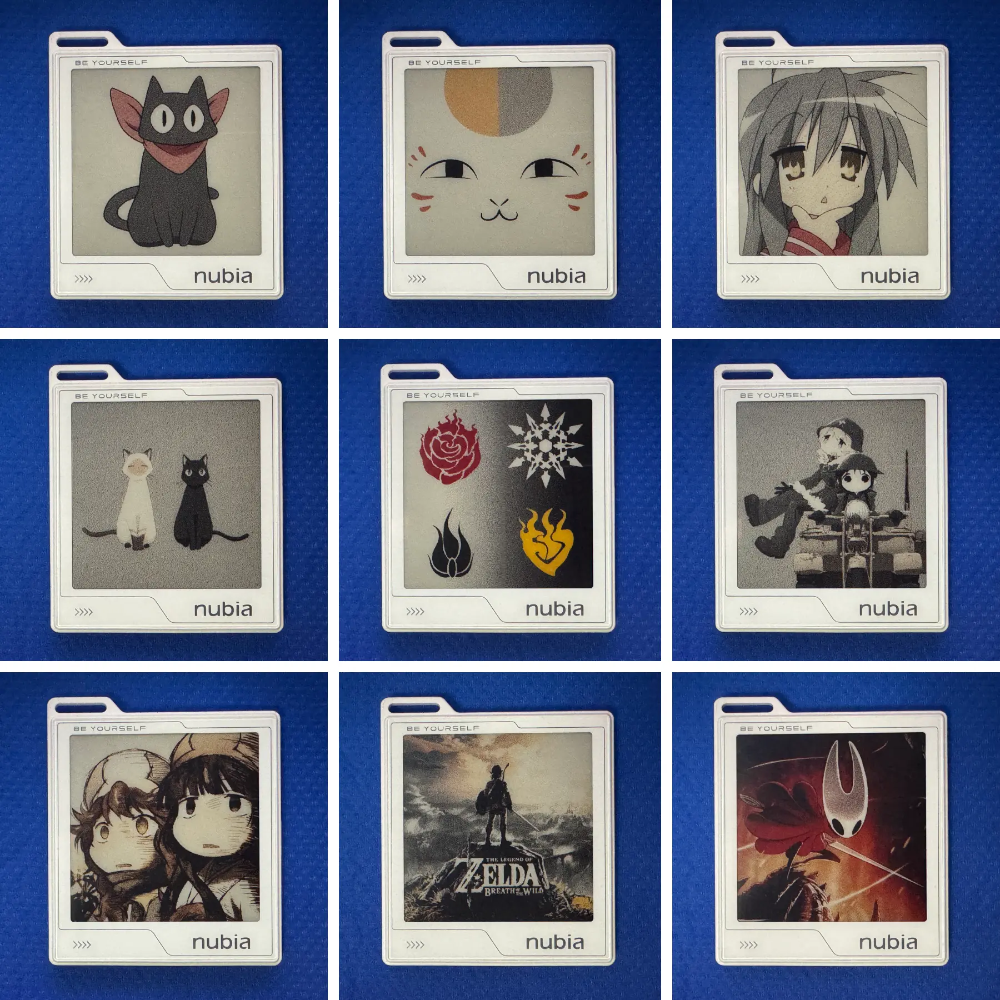

# inkako-web

A React + Web Bluetooth application that converts arbitrary images into the
4-color (Black / White / Yellow / Red) format used by the ZTE NDB-8 series of
e-ink Bluetooth photo frames and uploads them to the device directly from your
browser. No native app, no driver, no account — just open the page, pair, and
send.

The image processing pipeline (resize → color adjust → palette mapping →
optional Floyd–Steinberg dithering → BLE packing) is a JavaScript port of the
reverse-engineered Python reference at
[whoisnian/misc · cmd/inkako](https://github.com/whoisnian/misc/tree/master/cmd/inkako).

## Examples and results

<table>
  <tr>
    <th width="50%"><div align="center">Example images</div></th>
    <th width="50%"><div align="center">Photographed results</div></th>
  </tr>
  <tr>
    <td width="50%"></td>
    <td width="50%"></td>
  </tr>
</table>

The left grid shows the bundled sample images shipped under `public/examples/`.
The right grid shows the corresponding outputs photographed off a real NDB-8
device after running them through the in-browser pipeline and uploading over
Web Bluetooth.

## Browser / platform compatibility

Web Bluetooth is the limiting factor — anything that supports it should work.

| Browser | Platform | Status |
| --- | --- | --- |
| Chrome | Android | ✅ Works |
| Chrome | Windows | ✅ Works |
| [Bluefy](https://apps.apple.com/cn/app/bluefy-web-ble-browser/id1492822055) | iOS | ✅ Works (Safari/Chrome on iOS do *not* expose Web Bluetooth) |
| Chromium | Linux | ❌ `No Services matching UUID 79223401-1a11-21e1-8300-0940a1146603 found in Device` |

See the [WebBluetoothCG implementation status](https://github.com/WebBluetoothCG/web-bluetooth/blob/main/implementation-status.md)
for the authoritative matrix.

## Development

```sh
npm install
npm run dev      # esbuild dev server with watch
npm run build    # production build into dist/
npm run lint     # eslint
npm run release  # bump version, tag, push
```

The build script lives at `scripts/build.mjs`; the release script at
`scripts/release.mjs`. There is no framework-provided dev server — everything
is plain esbuild + React 19.

## External links

- [Official product page · ZTE Mall (CN)](https://www.ztemall.com/cn/goodsdetail/1453)
- [Official user manual · ZTE Devices BBS (CN)](https://m-bbs.ztedevices.com/?master_type=0&type=6&id=657159&state=)
- [Official Android app · Nubia App Store (CN)](https://m-appstore.nubia.com/detail_soft.html?softId=2192555)
- [InkBloom — unofficial iOS alternative · App Store (CN)](https://apps.apple.com/cn/app/inkbloom/id6462630055)
- [whoisnian/misc · cmd/inkako — Go/Python reverse-engineered CLI](https://github.com/whoisnian/misc/tree/master/cmd/inkako)
